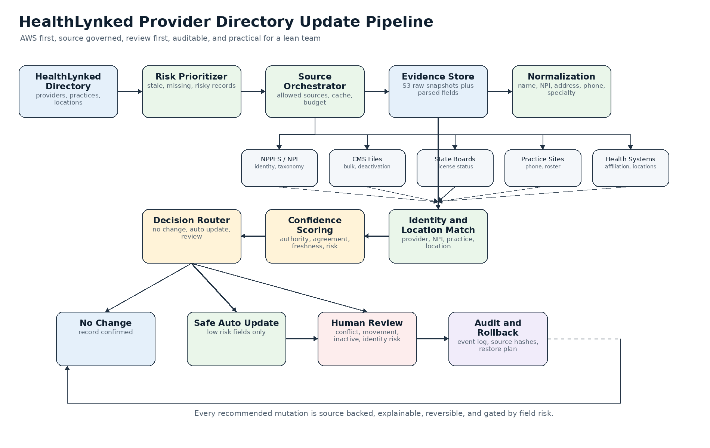
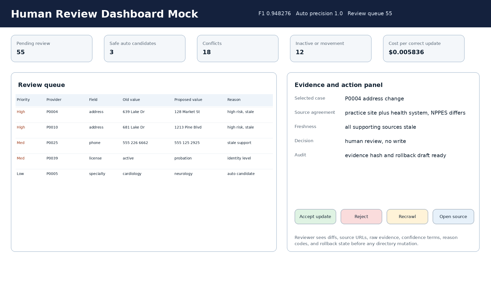

# Option C Hybrid Submission: Auditable Provider and Practice Directory Update Pipeline

## 1. Executive judgment

This submission treats HealthLynked directory quality as an ongoing evidence, decision, review, and audit system rather than a one time cleanup. The working MVP demonstrates the full loop on a synthetic benchmark that mirrors provider directory drift: stale phone numbers, address moves, specialty mismatch, license status changes, accepting patient changes, conflicting evidence, duplicate risk, provider movement risk, and inactive provider risk.

The proposed production system is conservative by design. It can discover many candidate changes, but it only auto updates low risk fields when confidence, source agreement, freshness, and field policy all pass. Identity sensitive changes such as NPI changes, inactive status, duplicate merge, affiliation change, and provider movement are review first. Every recommendation includes source observations, confidence terms, reason codes, audit fields, and rollback state.

Primary proof artifacts in this package:

| Artifact | Purpose |
|---|---|
| `HealthLynked_Provider_Directory_Update_Pipeline.ipynb` | End to end working MVP with saved outputs |
| `assets/architecture_diagram.png` | Production architecture overview |
| `assets/agent_workflow_diagram.png` | Bounded agent workflow with safety guardrails |
| `assets/human_review_dashboard_mock.png` | Human review workflow mock |
| `prototype/metrics.json` | Reproduced MVP metrics |
| `assets/sample_recommendations.json` | Recommendation API examples generated from the same run |
| `assets/sample_human_review_queue.json` | Human review queue examples generated from the same run |
| `assets/sample_audit_and_rollback.json` | Audit and rollback example |
| `evidence/verification.json` | Package verification report |

Supporting reproducibility links:

| Link | Purpose |
|---|---|
| GitHub repository: https://github.com/saademad200/provider_and_practice_directory | Public, clean source repository for the runnable MVP, notebook, proposal docs, diagrams, sample evidence, tests, and verification script |
| Google Drive folder: [paste public folder link] | Mirror of the same final package for judges who prefer direct file browsing or download |

Headline MVP results:

| Metric | Value |
|---|---:|
| Candidate updates found | 58 |
| Gold updates in synthetic benchmark | 58 |
| Field level F1 | 0.948276 |
| Precision | 0.948276 |
| Recall | 0.948276 |
| Safe auto apply updates | 3 |
| Safe auto apply precision | 1.0 |
| Human review items | 55 |
| Prototype evidence only cost | $0.321 |
| Prototype evidence only cost per correct update | $0.005836 |

These metrics are not presented as production truth. They are a reproducible MVP proof that the policy separates discovery from mutation, gives safe auto update precision priority over aggressive automation, and produces reviewer ready evidence.

## 2. Rubric mapping

| Competition criterion | What HealthLynked should want | Evidence in this submission |
|---|---|---|
| Accuracy | Detect true stale records while avoiding unsafe false changes | `prototype/metrics.json`, `evidence/verification.json`, `evidence/judge_rubric_self_eval.csv` |
| Scalability | Run periodically for thousands to millions of records | `proposal/TECHNICAL_ARCHITECTURE_PROPOSAL.md`, `appendix/CLOUD_AGNOSTIC_PRODUCTION_ARCHITECTURE.md` |
| Cost efficiency | Avoid unnecessary paid APIs, LLM calls, crawling, and manual labor | `assets/cost_model_per_1000_records.md`, `appendix/COST_MODEL.md`, `evidence/cost_model_per_1000.csv` |
| Practicality | Lean team can implement in a three month consulting engagement | `proposal/IMPLEMENTATION_ROADMAP_90_DAYS.md`, `proposal/JUDGE_DECISION_MEMO.md` |
| Explainability | Each update has source evidence, confidence, reason code, and field decision | `prototype/RECOMMENDATION_API_CONTRACT.md`, `assets/sample_recommendations.json` |
| Data quality | Normalize name, NPI, specialty, address, phone, practice and location fields | `src/data.py`, `src/specialty.py`, `src/npi.py`, `tests/` |
| Source reliability | Use trusted public or approved sources and handle conflicts conservatively | `assets/source_governance_matrix.md`, `proposal/SOURCE_ACCESS_COMPLIANCE_POLICY.md` |
| Human review design | Reduce manual review to uncertain, conflicting, or risky cases | `assets/human_review_dashboard_mock.png`, `dashboard/index.html`, `assets/sample_human_review_queue.json` |
| Audit trail | Trace every update to evidence, confidence, policy, and rollback | `assets/sample_audit_and_rollback.json`, `appendix/AUDIT_ROLLBACK_WORKFLOW.md`, `evidence/audit_events.jsonl` |

Bonus coverage:

| Bonus item | Included evidence |
|---|---|
| Working prototype | Notebook, scripts, source code, sample data, outputs |
| Agent workflow diagram | `assets/agent_workflow_diagram.png` |
| Cost estimate per 1,000 records | `assets/cost_model_per_1000_records.md` |
| Confidence scoring formula | `assets/confidence_scoring_formula.md` |
| Sample human review dashboard | `assets/human_review_dashboard_mock.png` and `dashboard/index.html` |
| Duplicate detection logic | `appendix/DUPLICATE_MOVEMENT_DETECTION.md`, `src/entity_resolution.py` |
| Address normalization strategy | `proposal/TECHNICAL_ARCHITECTURE_PROPOSAL.md`, USPS reference in source notes |
| NPI validation | `src/npi.py`, `tests/test_npi_validation.py` |
| Practice location matching | `src/entity_resolution.py`, `appendix/DUPLICATE_MOVEMENT_DETECTION.md` |
| Provider movement detection | `evidence/provider_movement_candidates.csv`, `src/entity_resolution.py` |
| Inactive provider detection | `evidence/inactive_provider_candidates.csv`, `src/inactive_detection.py` |
| Change history and audit log | `evidence/audit_events.jsonl`, `assets/sample_audit_and_rollback.json` |
| Safe auto update rules | `assets/launch_gates_matrix.md`, `proposal/CONFIDENCE_AND_DECISION_POLICY.md` |
| Clear implementation roadmap | `proposal/IMPLEMENTATION_ROADMAP_90_DAYS.md` |

## 3. Production architecture



Cloud-agnostic reference implementation (AWS examples):

| Layer | AWS service pattern | Purpose |
|---|---|---|
| Intake and scheduling | EventBridge plus Step Functions | Scheduled refresh, shadow mode batches, and targeted recrawls |
| Queueing | SQS | Back pressure, retry isolation, and source specific throttling |
| Compute | Lambda for light connectors, ECS Fargate for heavier parsing, AWS Batch for bulk runs | Cost efficient execution without a large standing cluster |
| Evidence lake | S3 | Raw source snapshots, parsed evidence, source hashes, and replay inputs |
| Operational store | Aurora PostgreSQL or RDS plus DynamoDB for queue state | Directory candidates, review states, audit index, idempotency keys |
| Search and review | OpenSearch optional, CloudFront hosted dashboard | Reviewer search over records, evidence, conflicts, and audit history |
| LLM fallback | Bedrock or approved model endpoint | Bounded extraction only after deterministic parsers fail |
| Monitoring | CloudWatch, CloudTrail, alarms | Source health, cost, review backlog, failed crawls, policy drift |

The key production decision is source governed orchestration. Each field has an allowed source set, source freshness SLA, source cost, retry budget, and mutation policy. The pipeline prefers bulk public data such as NPPES files where practical and only uses per record lookups or LLM extraction when the risk score justifies it.

## 4. Trusted source policy

The source strategy is field specific. NPPES is excellent for NPI identity, taxonomy, deactivation files, other names, and practice location reference files, but CMS explicitly states that NPI issuance does not validate provider licensure or credentialing. Source: https://download.cms.gov/nppes/NPI_Files.html

NUCC taxonomy codes help normalize specialty language, but NUCC states that taxonomy codes are self selected and scope of licensure is outside the taxonomy code set. Source: https://www.nucc.org/index.php/code-sets-mainmenu-41/provider-taxonomy-mainmenu-40

USPS Publication 28 is the address normalization reference for U.S. postal formats, suffixes, secondary unit designators, and address quality rules. Source: https://pe.usps.com/text/pub28/welcome.htm

State board checks are required for license sensitive status changes. FSMB provides a directory of state medical boards. Source: https://www.fsmb.org/contact-a-state-medical-board/

ABMS Certification Matters is useful for board certification lookup, but it is not a replacement for state license verification. Source: https://www.certificationmatters.org/

| Tier | Source | Best use | Auto update alone | Production policy |
|---|---|---|---|---|
| A | NPPES files and NPI Registry | NPI identity, taxonomy, deactivation, other names, practice locations | No | Strong identity evidence, not licensure proof |
| A | State medical boards | License status and discipline | No | Review first for all status changes |
| B | Official practice websites | Phone, address, roster, website, accepting status | Only with corroboration | Good for operational fields, never sole identity proof |
| B | Health system directories | Roster, affiliation, location, phone | Only with corroboration | Stronger than generic listing, still review first for movement |
| B | NUCC taxonomy | Specialty normalization | No | Normalization vocabulary, not licensure scope |
| C | Reputable business listings | Weak phone or address hint | No | Discovery and conflict signal only |
| D | Credential gated, blocked, unsupported, or terms incompatible pages | None | Never | Excluded |

## 5. Confidence formula and launch gates

Field confidence is decomposed into visible parts:

```text
confidence = source_authority_weight
           + source_agreement_weight
           + freshness_weight
           + identity_match_weight
           + field_stability_weight
           - conflict_penalty
           - stale_evidence_penalty
           - high_risk_field_penalty
```

Safe auto update policy:

| Field | Auto update allowed | Gate |
|---|---|---|
| Phone | Yes, after shadow mode | At least three trusted sources, confidence at least 0.96, fresh or partially stale evidence, no conflict |
| Website | Yes, after shadow mode | Canonical domain match and trusted source agreement |
| Specialty display normalization | Limited | At least three trusted sources, NPPES or health system support, no licensure implication |
| Address | No for launch | Human review due to movement, suite, and affiliation risk |
| Practice affiliation | No | Human review only |
| NPI | Never | Identity correction queue only |
| License or inactive status | Never | State board review required |
| Duplicate merge | Never | Merge review only |
| Provider movement | Never | Movement review only |

This policy is intentionally conservative. The MVP found 58 candidate updates, but auto applied only 3 low risk specialty display changes. Everything risky entered review.

## 6. Human review workflow



Human reviewers should not manually search from scratch. The dashboard should show:

| Feature | Judge value |
|---|---|
| Prioritized review queue | Reviews the riskiest and highest value items first |
| Old versus proposed diff | Reduces review time and mistakes |
| Source evidence panel | Shows URL, source tier, freshness, raw value, and normalized value |
| Reason codes | Explains why the system abstained |
| Accept, reject, recrawl, and escalate actions | Turns review into clean labeled feedback |
| Audit tab | Shows every source, policy, confidence score, and rollback row |
| Field level launch state | Prevents unsafe writes during pilot rollout |

Reviewer decisions become calibration labels. They are used to tune thresholds, source weights, and source age rules before any broader write access.

## 7. Audit and rollback

Every recommendation must be written to an append only audit ledger before any mutation. The audit event includes run ID, provider ID, practice ID, field, old value, proposed value, confidence, policy version, source URLs, source retrieval ages, evidence hash, actor, reviewer action, and rollback row.

Rollback is field level and policy aware. A rollback event restores the prior value from the audit row, records the rule or source that caused the reversal, and can disable the responsible rule through a kill switch.

Sample audit and rollback evidence is included in `assets/sample_audit_and_rollback.json`.

## 8. Cost model

The cost strategy has four controls:

1. Prioritize stale or risky records before fresh records.
2. Use bulk public files and cache source snapshots before calling per record APIs.
3. Run deterministic parsers first and call LLM extraction only for approved messy pages.
4. Send only uncertain, conflicting, stale, or identity sensitive cases to review.

Prototype evidence only cost from the MVP run:

| Component | Cost |
|---|---:|
| NPPES fixture evidence | $0.0045 |
| State license fixture evidence | $0.0075 |
| Practice website fixture evidence | $0.1760 |
| Health system fixture evidence | $0.1150 |
| Business listing fixture evidence | $0.0180 |
| Total evidence cost | $0.3210 |

Production per 1,000 record estimates are modeled in `assets/cost_model_per_1000_records.md` and `appendix/COST_MODEL.md`. The production cost model separates evidence retrieval from human labor because reviewer time dominates operating cost once the pipeline scales.

## 9. Working MVP

The MVP can be run from the package root:

```bash
python3 -m venv .venv
source .venv/bin/activate
pip install -r requirements.txt
python3 scripts/run_best_pipeline.py --out-dir outputs/judge_smoke
python3 scripts/verify_pipeline.py
```

Expected files:

```text
outputs/judge_smoke/candidate_updates.csv
outputs/judge_smoke/auto_apply_updates.csv
outputs/judge_smoke/review_queue.csv
outputs/judge_smoke/metrics.json
```

Expected metrics:

```json
{
  "f1": 0.948276,
  "precision": 0.948276,
  "recall": 0.948276,
  "auto_apply_precision": 1.0,
  "predicted_updates": 58,
  "gold_updates": 58,
  "auto_apply_count": 3,
  "review_count": 55
}
```

## 10. Three month consulting roadmap

| Phase | Goal | Deliverables |
|---|---|---|
| Days 1 to 30 | Shadow mode and schema mapping | HealthLynked schema adapter, NPPES bulk/API connector, source registry, no write benchmark, reviewer agreement baseline |
| Days 31 to 60 | Review operations and calibration | Dashboard, source freshness monitors, field level confidence calibration, audit ledger, rollback runbook |
| Days 61 to 90 | Controlled launch | Low risk phone or website launch gate, policy kill switches, monitoring dashboards, review SLA, production handoff |

Launch criteria:

| Gate | Requirement |
|---|---|
| Shadow precision | Reviewer accepted precision meets agreed threshold by field |
| Review recall | High risk records are captured in review |
| Source health | Core sources meet freshness and availability thresholds |
| Audit completeness | Every mutation has source hash and rollback row |
| Cost ceiling | Per 1,000 record cost stays within budget |
| Kill switch | Field level write policies can be disabled immediately |

## 11. Red team risks and mitigations

| Risk | Failure mode | Mitigation |
|---|---|---|
| Same name collision | Wrong provider updated | NPI anchored identity, location and specialty checks, review first for ambiguity |
| NPI typo | Bad identity link | Check digit validation and manual review |
| NPPES stale data | Old address overwrites current site | Source freshness and multi source agreement |
| Practice rebrand | False duplicate or false movement | Practice alias table and reviewer confirmation |
| Phone reused by group | Individual provider phone changed incorrectly | Practice location matching and source corroboration |
| Suite drift | Address change looks larger than it is | USPS style normalization plus suite aware diff |
| False inactive | Active provider suppressed | State board confirmation and review first policy |
| Source outage | Recrawl fails and stale data used | Source health status, cached snapshots, retry budget |
| LLM hallucination | Extracted field not grounded | Bounded extraction schema, quote evidence, no autonomous writing |
| Unsupported source access | Legal or terms issue | Source allowlist, no credential gated scraping, source access policy |

## 12. Implementation value

This submission covers the full competition prompt and the bonus list while staying realistic for HealthLynked. It gives a runnable MVP, clear production plan, safe launch policy, trusted source governance, cost controls, review workflow, audit and rollback, and a 90 day consulting path. The strongest design choice is conservative mutation. The system can find candidate changes at scale without risking silent identity or affiliation errors.
