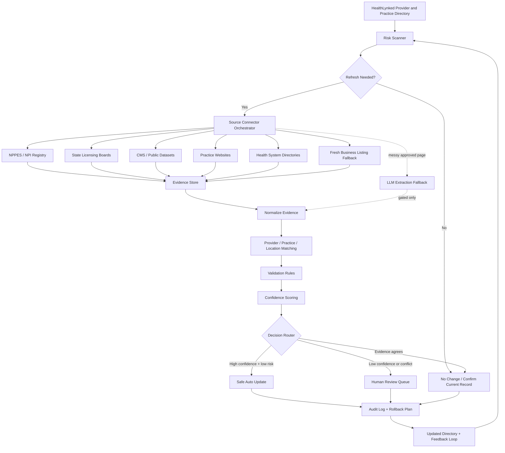
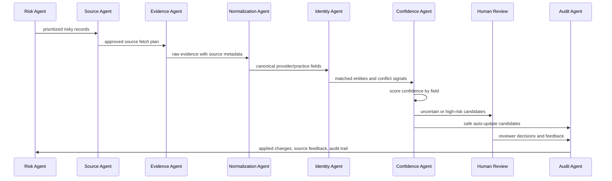

# Architecture Diagram

```mermaid
flowchart TD
    A[HealthLynked Provider and Practice Directory] --> B[Risk Scanner]
    B --> C{Refresh Needed?}
    C -->|No| N[No Change / Confirm Current Record]
    C -->|Yes| D[Source Connector Orchestrator]

    D --> S1[NPPES / NPI Registry]
    D --> S2[State Licensing Boards]
    D --> S3[CMS / Public Datasets]
    D --> S4[Practice Websites]
    D --> S5[Health System Directories]
    D --> S6[Fresh Business Listing Fallback]

    S1 --> E[Evidence Store]
    S2 --> E
    S3 --> E
    S4 --> E
    S5 --> E
    S6 --> E

    E --> F[Normalize Evidence]
    F --> G[Provider / Practice / Location Matching]
    G --> H[Validation Rules]
    H --> I[Confidence Scoring]

    I --> J{Decision Router}
    J -->|High confidence + low risk| K[Safe Auto Update]
    J -->|Low confidence or conflict| L[Human Review Queue]
    J -->|Evidence agrees| N

    K --> M[Audit Log + Rollback Plan]
    L --> M
    N --> M

    M --> O[Updated Directory + Feedback Loop]
    O --> B

    P[LLM Extraction Fallback] -. gated only .-> F
    D -. messy approved page .-> P
```

## Agent Workflow

```mermaid
sequenceDiagram
    participant R as Risk Agent
    participant S as Source Agent
    participant E as Evidence Agent
    participant N as Normalization Agent
    participant I as Identity Agent
    participant C as Confidence Agent
    participant H as Human Review
    participant A as Audit Agent

    R->>S: prioritized risky records
    S->>E: approved source fetch plan
    E->>N: raw evidence with source metadata
    N->>I: canonical provider/practice fields
    I->>C: matched entities and conflict signals
    C->>C: score confidence by field
    C->>H: uncertain or high-risk candidates
    C->>A: safe auto-update candidates
    H->>A: reviewer decisions and feedback
    A->>R: applied changes, source feedback, audit trail
```
