# Agent Workflow Diagram

This diagram gives judges a compact view of the agentic provider-directory update pipeline: source contracts, retrieval, normalization, identity resolution, conflict handling, scoring, safety evals, human review, audit/rollback, and monitoring feedback.

## Current Quality Context

- F1: 0.948276
- Precision: 0.948276
- Recall: 0.948276
- Auto-apply precision: 1.0

## Mermaid Diagram

```mermaid
flowchart LR
    schedule[EventBridge Scheduler] --> source_registry[Source Connector Registry]
    source_registry --> source_fetch[Source Retrieval Agents]
    source_fetch --> normalize[Evidence Normalization Agent]
    normalize --> identity[Identity Resolution Agent]
    identity --> conflict[Source Conflict Agent]
    conflict --> score[Evidence Scoring Agent]
    score --> safety[Trajectory And Red-Team Evals]
    safety --> route{Auto-Apply Or Review?}
    route -->|safe low-risk update| audit[Audit And Rollback Agent]
    route -->|ambiguous/high-risk| review[Human Review Workbench]
    review --> audit
    audit --> monitor[Monitoring And Learning Loop]
    monitor --> source_registry

    classDef control fill:#e8f1f8,stroke:#1e6b9e,color:#16202a
    classDef human fill:#fff4df,stroke:#9a6b1d,color:#16202a
    classDef safety fill:#fbe7e7,stroke:#a33a3a,color:#16202a
    class source_registry,source_fetch,normalize,identity,conflict,score,audit,monitor control
    class review human
    class safety safety
```

## Node Metadata

| Node ID | Label | Owner | Evidence Artifact |
|---|---|---|---|
| schedule | EventBridge Scheduler | platform | AWS_PRODUCTION_ARCHITECTURE.md |
| source_registry | Source Connector Registry | source_ops | SOURCE_CONNECTOR_REGISTRY.md |
| source_fetch | Source Retrieval Agents | source_ops | evidence_tool_manifest.json |
| normalize | Evidence Normalization Agent | data_quality | bedrock_extraction_contract.json |
| identity | Identity Resolution Agent | identity_ops | DUPLICATE_MOVEMENT_DETECTION.md |
| conflict | Source Conflict Agent | data_quality | SOURCE_CONFLICT_ADJUDICATION.md |
| score | Evidence Scoring Agent | ml_ops | candidate_updates.csv |
| safety | Trajectory And Red-Team Evals | ml_ops | RED_TEAM_EVALS.md |
| route | Auto-Apply Or Review Router | directory_ops | review_queue.csv |
| review | Human Review Workbench | directory_ops | REVIEW_DISPOSITION_AND_SLA.md |
| audit | Audit And Rollback Agent | compliance | AUDIT_ROLLBACK_WORKFLOW.md |
| monitor | Monitoring And Learning Loop | platform | MONITORING_ALERTS.md |

## Edge Metadata

| From | To | Handoff |
|---|---|---|
| schedule | source_registry | batch plan and source policy |
| source_registry | source_fetch | approved tools and freshness SLAs |
| source_fetch | normalize | raw evidence snapshots |
| normalize | identity | canonical evidence rows |
| identity | conflict | matched provider/practice candidates |
| conflict | score | adjudicated evidence and conflict flags |
| score | safety | candidate updates with confidence and traces |
| safety | route | passed evals and blocked forbidden outcomes |
| route | review | ambiguous or high-risk review queue |
| route | audit | safe auto-apply candidates |
| review | audit | review dispositions and audit event IDs |
| audit | monitor | applied updates, rollback plans, audit bundles |
| monitor | source_registry | source health, cost drift, reviewer feedback |

## Why This Matters

- The workflow is not a single opaque agent. It is a controlled harness with specialized lanes and explicit handoffs.
- Safety gates sit before auto-apply and before human-reviewed mutations.
- Monitoring feeds back into source policy, reviewer learning, and future threshold tuning.
