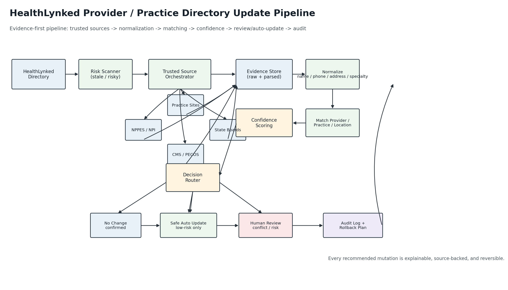
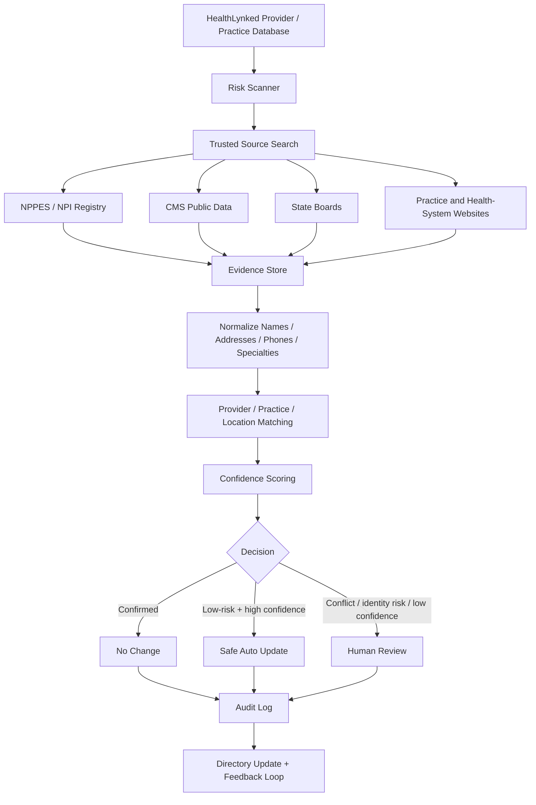
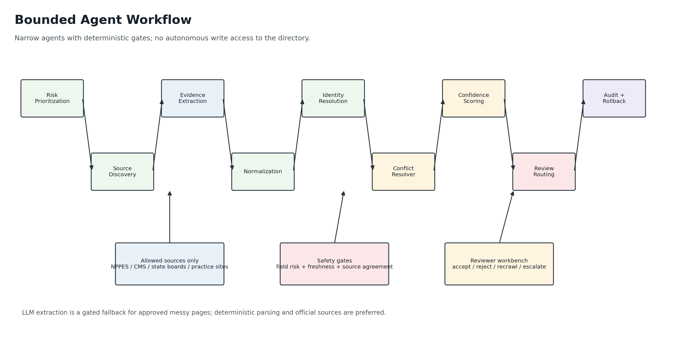
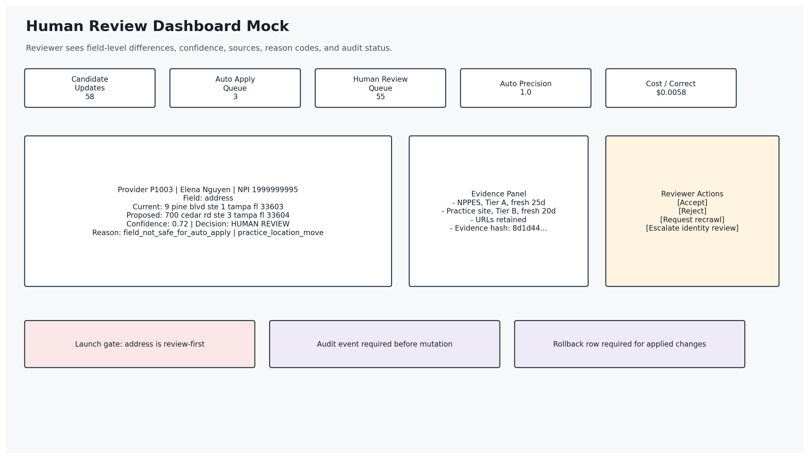

# HealthLynked Provider & Practice Directory Update Pipeline

## Option C Hybrid Submission

This submission proposes and demonstrates a repeatable provider/practice directory quality pipeline. It is not a one-time cleanup. It is a governed operating loop that continuously finds stale records, searches trusted sources, normalizes evidence, scores confidence, separates safe updates from human review, and records an audit trail before any directory mutation.

The package is intentionally submitted as two judge-facing artifacts:

- `HealthLynked_Provider_Directory_Option_C_Writeup.md`
- `HealthLynked_Provider_Directory_Update_Pipeline.ipynb`

The GitHub repository can be used as optional reproducibility evidence for the runnable prototype, sample data, dashboard, audit events, and verification checks.

## Executive Summary

HealthLynked's provider directory should be maintained by a quality control plane, not by manual search or an opaque scraper. The proposed system combines deterministic public-source checks, bounded AI agents, conservative auto-update rules, and reviewer-visible evidence.

The MVP demonstrates the core loop on sample provider/practice data:

| Metric | MVP Result |
|---|---:|
| Field-level F1 | `0.948276` |
| Precision | `0.948276` |
| Recall | `0.948276` |
| Safe auto-apply precision | `1.0` |
| Candidate updates found | `58` |
| Safe auto-apply updates | `3` |
| Human-review items | `55` |
| Prototype evidence-only cost per correct update | `$0.005836` |

The key design choice is separation of discovery from mutation. The system may discover many candidate changes, but it auto-updates only low-risk fields with fresh, corroborated evidence. Identity-sensitive, conflicting, stale, or low-confidence changes go to human review.

## How To Evaluate This Submission

The writeup is the primary proposal artifact. The notebook is a self-contained MVP demonstration that can be executed without the full repository. The optional GitHub repository provides the larger reproducible benchmark, sample data, dashboard HTML, audit outputs, and verifier.

| Evidence | Where to inspect |
|---|---|
| Main architecture and production plan | This writeup |
| Runnable self-contained MVP | `HealthLynked_Provider_Directory_Update_Pipeline.ipynb` |
| Architecture diagram image | `assets/architecture_diagram.png` |
| Agent workflow image | `assets/agent_workflow_diagram.png` |
| Human review dashboard mock | `assets/human_review_dashboard_mock.png` |
| Sample input records | `assets/sample_input.csv` |
| Sample recommendations | `assets/sample_recommendations.json` |
| Sample review queue | `assets/sample_human_review_queue.json` |
| Sample audit and rollback | `assets/sample_audit_and_rollback.json` |
| Larger reproducible benchmark | Optional GitHub repo, `scripts/run_best_pipeline.py` |
| Sample human review dashboard | Optional GitHub repo, `submissions/healthlynked_option_c_clean/dashboard/index.html` |
| Audit events and rollback examples | Inline below, plus optional GitHub repo evidence files |
| Verification checks | Optional GitHub repo, `evidence/verification.json` |

The benchmark figures in the executive summary come from the larger reproducible sample run in the optional repository. The submitted notebook intentionally uses a smaller inline sample so judges can inspect and run the core logic without needing external files.

## Rubric-To-Evidence Map

| Evaluation criterion | How this submission addresses it | Evidence in main artifacts |
|---|---|---|
| Accuracy | Uses authority-tiered source evidence, source agreement, freshness, field-risk penalties, and review-first routing for uncertain changes. | Notebook scoring loop; confidence formula; field risk policy |
| Scalability | Separates source ingestion, normalization, scoring, queues, review, audit, and monitoring so each component can scale independently. | Production roadmap; cloud-agnostic operating model |
| Cost efficiency | Prioritizes risky/stale records, caches public files, uses deterministic parsers first, and gates LLM fallback. | Cost model per 1,000 records |
| Practicality | Defines a 30/60/90-day implementation plan suitable for a lean engineering team. | Production roadmap and operating model |
| Explainability | Each recommendation includes changed field, old/new value, confidence, reason code, sources, evidence URLs, and evidence hash. | Notebook recommendation table; sample JSON |
| Data quality | Covers normalization for names, phones, addresses, specialties, websites, status, NPI, and practice/location matching. | Normalization policy; notebook helpers |
| Source reliability | Uses explicit source tiers and separates identity, licensure, taxonomy, address, and practice-roster evidence. | Source governance matrix |
| Human review design | Sends high-risk, conflicting, stale, and low-confidence changes to a reviewer queue with action states. | Dashboard mock; review queue examples |
| Audit trail | Writes immutable recommendation events, evidence hashes, and rollback rows before mutation. | Sample audit and rollback JSON |

## Bonus Coverage Map

| Bonus item | Covered? | Evidence |
|---|---|---|
| Working prototype | Yes | Submitted notebook; optional larger repo benchmark |
| Agent workflow diagram | Yes | Mermaid diagram below |
| Cost estimate per 1,000 records | Yes | Numeric cost table below |
| Confidence scoring formula | Yes | Formula and thresholds below |
| Sample human review dashboard | Yes | Inline dashboard mock and optional HTML dashboard |
| Duplicate detection logic | Yes | Notebook duplicate NPI flag; optional repo movement/duplicate diagnostics |
| Address normalization strategy | Yes | USPS Publication 28-aligned policy below |
| NPI validation | Yes | Notebook NPI validation and source governance |
| Practice-location matching | Yes | Matching policy and review-first movement handling |
| Provider movement detection | Yes | Field risk policy and optional repo movement candidates |
| Inactive/retired provider detection | Yes | State-board/NPPES deactivation review policy |
| Change history and audit log | Yes | Sample audit JSON |
| Safe auto-update rules | Yes | Field risk and launch gates |
| Clear implementation roadmap | Yes | 30/60/90-day plan |

## Desired Pipeline Architecture

```text
HealthLynked Provider / Practice Database
  ↓
Find Outdated or Risky Records
  ↓
Search Trusted Sources
NPI, CMS, state boards, practice websites
  ↓
Collect Updated Provider / Practice Data
  ↓
Clean and Normalize Data
Names, addresses, phones, specialties
  ↓
Match Provider / Practice Records
  ↓
Assign Confidence Score
  ↓
Decision
No Change | Auto Update | Human Review
Record confirmed as accurate | High-confidence update | Low-confidence or conflicting data
  ↓
Save Audit Log + Update Provider Directory
```

## Architecture Diagram





## Agent Workflow Diagram

```mermaid
flowchart LR
    A[Risk Prioritization Agent] --> B[Source Discovery Agent]
    B --> C[Evidence Extraction Agent]
    C --> D[Normalization Agent]
    D --> E[Identity Resolution Agent]
    E --> F[Source Conflict Resolver]
    F --> G[Confidence Scoring Agent]
    G --> H[Human Review Routing Agent]
    H --> I[Audit And Rollback Agent]
    I --> J[Monitoring And Calibration Loop]
```





## How The Pipeline Works

### 1. Find Outdated Or Risky Records

The system prioritizes records likely to be stale or risky:

- old `last_verified_at` timestamps;
- missing or malformed NPI, phone, website, address, or specialty;
- provider/practice records with conflicting internal fields;
- providers with multiple practice locations;
- specialties or affiliations that commonly drift;
- providers previously flagged by reviewers or patient/user feedback;
- practice locations with signs of closure, rebrand, acquisition, or relocation.

This avoids spending source/API/reviewer budget on already-fresh low-risk records.

### 2. Search Trusted Sources

The source strategy is authority-tiered:

| Tier | Source Type | Use |
|---|---|---|
| A | NPPES / NPI Registry, CMS public enrollment surfaces, state licensing boards | identity, NPI, specialty taxonomy, license/activity status |
| B | practice websites, health-system directories | phone, address, roster, affiliation, website, accepting status |
| C | reputable business listings | fallback for phone/address only, low weight |
| D | untrusted or unsupported pages | never used for auto-update |

Source access is legally conservative. The system uses public or contractually approved sources, respects terms of use, records source URLs and retrieval timestamps, and keeps raw evidence snapshots for audit.

## Source Governance Matrix

This table turns “trusted sources” into an operating policy.

| Tier | Source | Best use | Can auto-update from this alone? | Operating note |
|---|---|---|---|---|
| A | CMS NPPES monthly/weekly downloadable files and deactivation data | NPI identity, provider names, taxonomy, practice locations, deactivation signals | No, except low-risk confirmation with corroboration | CMS publishes downloadable NPI files and deactivation data. CMS also states that having an NPI does not ensure a provider is licensed or credentialed. See CMS NPI files: https://download.cms.gov/nppes/NPI_Files.html and CMS NPI fact sheet: https://www.cms.gov/files/document/npi-fact-sheet.pdf |
| A | State medical boards | License status, disciplinary signals, professional standing | No for status changes; review first | State board evidence is the appropriate authority for licensure-sensitive decisions. |
| B | NUCC provider taxonomy | Specialty normalization vocabulary | No | NUCC states taxonomy codes are self-selected and do not establish licensure scope. See https://www.nucc.org/index.php/code-sets-mainmenu-41/provider-taxonomy-mainmenu-40 |
| B | Practice and health-system websites | Phone, address, roster, affiliation, website | Only for low-risk fields with corroboration and freshness checks | Useful for current operational details, but roster/affiliation changes remain review-first. |
| B | USPS Publication 28 or conforming address software | Address standardization | Not a source of truth by itself | Publication 28 defines U.S. postal addressing standards. See https://pe.usps.com/text/pub28/welcome.htm |
| C | Reputable business listings | Phone/address hints only | Never alone | Weak support source; can help prioritize review or corroborate low-risk fields. |
| D | Blocked, gated, unsupported, or terms-incompatible scraping | None | Never | Excluded from production connectors. |

### Healthcare Source Limitations

- NPPES/NPI is an identity and enumeration source, not proof of licensure or credentialing.
- NUCC taxonomy is useful for specialty normalization, but taxonomy codes are self-selected and do not prove scope of practice.
- State boards and official licensing sources should drive active/inactive and licensure-sensitive decisions.
- Practice websites are useful for current operational details, but provider movement, affiliation, and identity-sensitive changes remain review-first.
- USPS Publication 28-style normalization improves address quality, but address deliverability does not prove that a provider currently practices at the location.

### 3. Collect And Normalize Evidence

Every source observation is normalized before comparison:

- provider names: case, punctuation, suffixes, initials, credentials;
- practice names: aliases, DBA names, health-system branding;
- phones: E.164-style normalization, extensions, invalid patterns;
- addresses: street suffixes, suites, city/state/ZIP, deliverability-ready canonical form;
- specialties: NUCC/NPPES-style taxonomy mapping and synonym handling;
- websites: canonical domain, protocol normalization, tracking-parameter removal;
- active/inactive status: source-specific status mapped into a common lifecycle vocabulary.

Raw and normalized values are retained side by side so reviewers can see exactly what changed.

### 4. Match Provider / Practice Records

Matching is not a naive string join. The pipeline resolves:

- provider identity anchored by NPI where available;
- provider name similarity with specialty and location checks;
- practice-location matching across phone, address, website, and roster;
- duplicate provider records;
- provider movement between practices or locations;
- inactive or retired providers.

High-risk identity actions, including merges, NPI changes, suppressions, and provider movement, are review-first.

### 5. Assign Confidence Score

The confidence score is decomposed so it can be explained to a reviewer:

```text
confidence =
  source_authority_weight
  + source_agreement_weight
  + freshness_weight
  + field_stability_weight
  + identity_match_weight
  - conflict_penalty
  - stale_evidence_penalty
  - high_risk_field_penalty
```

The MVP exposes confidence, review priority, source set, evidence URLs, reason codes, freshness status, and recommended action for each candidate update.

### 6. Decision Policy

| Decision | Meaning | Example |
|---|---|---|
| No Change | Existing record is confirmed or evidence is insufficient | NPPES and practice website agree with current phone |
| Auto Update | Low-risk field, high confidence, fresh corroborated evidence, audit-ready | phone or specialty with independent trusted-source agreement |
| Human Review | Low confidence, stale evidence, conflict, identity risk, or practice movement | address move, inactive status, affiliation change, NPI/name conflict |

Safe auto-update rules are deliberately narrow. In the MVP, auto-apply precision is `1.0`; uncertain cases are routed to review instead of silently changed.

## Field Risk And Launch Gates

| Field | Risk | Auto-update policy | Required evidence |
|---|---|---|---|
| Phone | Low/medium | Allowed only with high confidence, fresh evidence, and independent source agreement | NPPES/practice/health-system agreement or equivalent |
| Website | Low/medium | Allowed only when canonical domain is corroborated and not a parked/redirected page | Practice or health-system source plus URL validation |
| Specialty | Medium | Allowed only when taxonomy/display specialty mapping is stable and corroborated | NPPES/NUCC normalization plus practice or health-system agreement |
| Address | High | Review-first | NPPES plus practice/health-system evidence and movement checks |
| Practice affiliation | High | Review-first | Practice roster, health-system source, and identity/location match |
| Provider name | High | Review-first | NPI identity, name history, and reviewer approval |
| NPI | Identity-critical | Never auto-update | Manual identity resolution |
| Active/inactive status | High | Review-first | State board or authoritative status evidence; NPPES deactivation as signal, not sole proof |
| Duplicate merge | Identity-critical | Never auto-update | Human identity resolution and rollback plan |

Launch gates before any auto-update:

1. field is allowed for auto-update;
2. confidence is above the field threshold;
3. at least two independent trusted sources support the value;
4. evidence is fresh for the field;
5. there is no high-risk identity flag;
6. audit event and rollback row can be written before mutation;
7. shadow-mode precision for that field remains above the production threshold.

### 7. Audit Log And Update

Every recommendation carries:

- provider ID and NPI;
- changed field;
- current value and proposed value;
- confidence score;
- source observations and source URLs;
- reason code;
- decision;
- evidence hash;
- rollback eligibility;
- reviewer/auditor trace.

This makes each update explainable and reversible.

## AI Agent Design

The proposed agent workflow is bounded and auditable:

1. Risk Prioritization Agent selects records to refresh.
2. Source Discovery Agent chooses allowed sources by authority, cost, and field.
3. Evidence Extraction Agent retrieves or parses evidence.
4. Normalization Agent canonicalizes names, addresses, phones, specialties, websites, and statuses.
5. Identity Resolution Agent matches provider, NPI, practice, and location.
6. Confidence Scoring Agent creates score, action, and explanation.
7. Human Review Routing Agent queues uncertain or risky updates.
8. Audit And Rollback Agent writes evidence hashes, events, and rollback rows.

LLM extraction is not the default path. It is a gated fallback for approved messy pages after deterministic parsing fails.

## Cost Controls

The design keeps cost low by:

- refreshing risky/stale records before fresh records;
- caching public source snapshots;
- preferring bulk public files over per-record API calls;
- using deterministic extraction before LLM fallback;
- limiting LLM calls to approved pages and fields;
- deduplicating provider/practice/location evidence before scoring;
- routing only uncertain or high-risk cases to humans.

### Example Cost Per 1,000 Records

Assumptions for a 1,000-record refresh:

- public/bulk evidence is cached where possible;
- deterministic extraction is attempted before LLM fallback;
- manual review is estimated at 2 minutes per item and `$30/hour` loaded cost;
- LLM fallback is reserved for approved messy pages;
- cloud infrastructure is described generically, with AWS only as a reference implementation.

| Scenario | Evidence retrieval | Cloud compute/storage/monitoring | LLM fallback | Manual review | Review items | Total / 1,000 |
|---|---:|---:|---:|---:|---:|---:|
| Low-risk periodic refresh | `$4.50` | `$3.00` | `$1.00` | `$50.00` | `50` | `$58.50` |
| Base production run | `$9.00` | `$6.00` | `$5.00` | `$150.00` | `150` | `$170.00` |
| High-risk backlog cleanup | `$18.00` | `$10.00` | `$15.00` | `$350.00` | `350` | `$393.00` |

The operating model is deliberately dominated by human review cost, not model cost. The main savings lever is better routing: avoid sending obvious no-change records to reviewers and avoid using LLMs where deterministic source parsing is sufficient.

Cloud services are intentionally described generically. If a concrete reference is useful, AWS can be used as an example implementation: object storage similar to S3, workflow orchestration similar to Step Functions, queueing similar to SQS, serverless/container workers similar to Lambda/ECS/Batch, monitoring similar to CloudWatch, and governed foundation-model fallback similar to Bedrock.

## Human Review Dashboard

The MVP includes a sample dashboard concept showing:

- headline quality metrics;
- review queue rows with old/new value, confidence, reason, sources, and evidence URLs;
- accept, reject, and recrawl actions;
- launch gates for auto-update eligibility;
- inactive-provider candidates;
- rollback and audit evidence.

The dashboard is designed to reduce reviewer work, not create a second manual cleanup project.



### Reviewer Decision Card Mock

```text
Provider: P1003 / Elena Nguyen / NPI 1999999995
Field: address
Current value: 9 pine blvd ste 1 tampa fl 33603
Proposed value: 700 cedar rd ste 3 tampa fl 33604
Confidence: 0.72
Decision: HUMAN REVIEW
Reason: field_not_safe_for_auto_apply | practice_location_move
Supporting sources:
  - NPPES, fresh 25 days, https://npiregistry.cms.hhs.gov/...
  - Practice website, fresh 20 days, https://coastalskin.example.com/location
Reviewer actions:
  [Accept] [Reject] [Request recrawl] [Escalate identity review]
Audit status:
  evidence_hash=8d1d44cbd247fe7e, rollback_required=true
```

## Sample Recommendation Contract

```json
{
  "provider_id": "P1001",
  "npi": "1234567893",
  "change_detected": true,
  "field": "phone",
  "old_value": "555-200-1000",
  "proposed_value": "555-201-1000",
  "confidence": 0.98,
  "recommended_action": "auto_update",
  "reason_code": "auto_apply_criteria_met",
  "supporting_sources": [
    {
      "source": "practice_website",
      "authority_tier": "B",
      "fresh_days": 12,
      "url": "https://bayviewprimary.example.com/contact"
    },
    {
      "source": "health_system",
      "authority_tier": "B",
      "fresh_days": 24,
      "url": "https://healthsystem.example.com/maya-patel"
    }
  ],
  "evidence_hash": "4d5e3a9b7d2c1110",
  "audit_required": true,
  "rollback_eligible": true
}
```

## Sample Audit And Rollback Records

```json
{
  "event_type": "candidate_update_created",
  "event_date": "2026-06-22",
  "provider_id": "P1001",
  "npi": "1234567893",
  "field": "phone",
  "old_value": "555-200-1000",
  "proposed_value": "555-201-1000",
  "confidence": 0.98,
  "recommended_action": "auto_update",
  "reason_code": "auto_apply_criteria_met",
  "sources": ["practice_website", "health_system"],
  "evidence_hash": "4d5e3a9b7d2c1110"
}
```

```json
{
  "provider_id": "P1001",
  "field": "phone",
  "current_value_to_replace": "555-201-1000",
  "restore_value": "555-200-1000",
  "required_approval": "directory_ops_lead",
  "evidence_hash": "4d5e3a9b7d2c1110"
}
```

## Evaluation Protocol

The larger optional benchmark computes field-level candidate updates against a labeled sample dataset:

- true positive: proposed field update matches the labeled update;
- false positive: proposed field update is not in the gold update set;
- false negative: gold update is missed;
- precision: `TP / (TP + FP)`;
- recall: `TP / (TP + FN)`;
- F1: harmonic mean of precision and recall;
- safe auto-apply precision: precision among the subset that passes auto-update gates.

The reported benchmark result is:

```text
TP = 55
FP = 3
FN = 3
Precision = 0.948276
Recall = 0.948276
F1 = 0.948276
Safe auto-apply precision = 1.0
```

The submitted notebook is a smaller, fully inline demonstration of the same control logic. It is not meant to be the full benchmark dataset.

## MVP Scope Covered

The prototype covers the suggested MVP fields:

- provider name;
- NPI;
- specialty;
- practice name;
- address;
- phone number;
- website;
- active/inactive status.

It also demonstrates bonus areas:

- confidence scoring formula;
- duplicate detection logic;
- address normalization strategy;
- NPI validation;
- practice-location matching;
- provider movement detection;
- inactive/retired provider detection;
- audit log;
- rollback plan;
- safe auto-update rules;
- human review queue;
- implementation roadmap;
- cloud-agnostic scaling plan with AWS as an example only.

## Production Roadmap

### First 30 Days

- Map HealthLynked production schema to the recommendation contract.
- Run no-write shadow mode on a representative sample.
- Validate NPI, phone, address, specialty, practice, and website normalization.
- Measure source coverage and reviewer agreement.
- Calibrate confidence thresholds.

### Days 31-60

- Add official/bulk source connectors.
- Deploy review workflow and reviewer disposition capture.
- Add connector health checks and source freshness monitoring.
- Produce daily audit bundles and rollback plans.
- Tune thresholds using reviewer decisions.

### Days 61-90

- Enable low-risk auto-update only for fields that pass launch gates.
- Keep identity-level changes review-first.
- Expand state-board and health-system coverage.
- Add production monitoring for cost, freshness, precision, review backlog, and drift.
- Prepare staged rollout with field-level kill switches.

## Implementation Value

This approach is practical rather than speculative. It gives HealthLynked:

- a clear architecture;
- a working prototype;
- a conservative confidence policy;
- trusted-source governance;
- human review only where needed;
- audit and rollback from day one;
- a scalable path a lean engineering team can implement during the post-award consulting period.

The core implementation principle is simple: provider directory quality is not solved by scraping more pages. It is solved by a repeatable evidence-and-decision system that knows when to trust, when to abstain, when to ask a human, and how to prove every change afterward.
