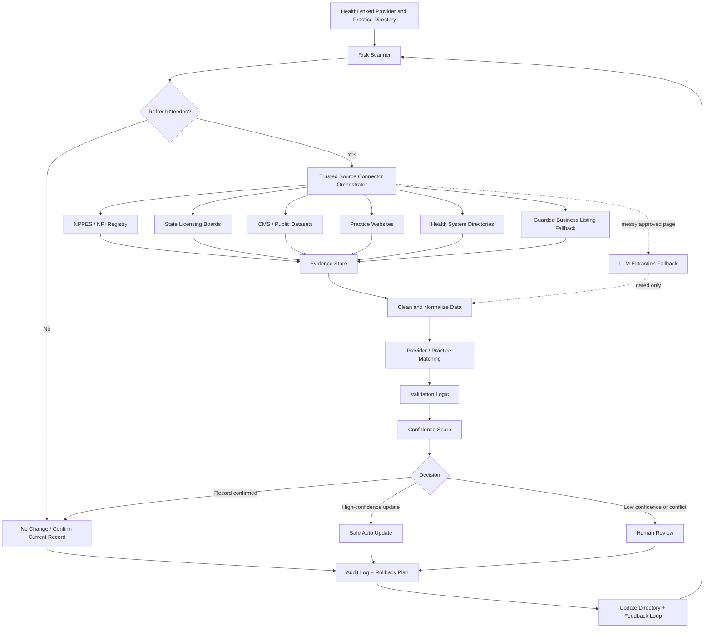

# Architecture Diagram

## Render-Free Diagram

```text
HealthLynked directory
  -> risk scanner
  -> trusted source connector orchestrator
  -> evidence store
  -> normalization
  -> provider / practice / location matching
  -> validation logic
  -> confidence score
  -> decision router
       -> no change: confirm current record
       -> safe high-confidence update: auto-update
       -> conflict or low confidence: human review
  -> audit log + rollback plan
  -> directory update + feedback loop
```

LLM extraction is a gated fallback for approved but messy pages. It is not the default retrieval path.

## Mermaid Diagram


